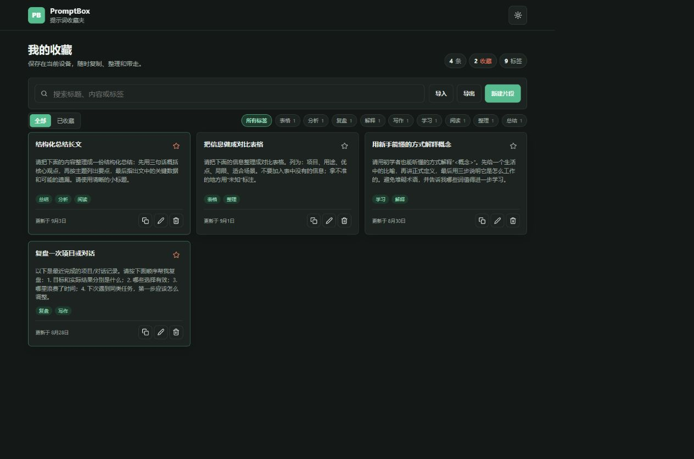

# PromptBox

一个无需安装、数据保存在本地的 AI 提示词收藏夹。收藏用着顺手或值得回味的提示词，之后用关键词、标签和收藏状态快速找到并复制。

[English](./README.en.md)



## 为什么做这个

好的提示词经常散落在聊天记录、浏览器标签页和备忘录里，等真正需要时又找不到。PromptBox 把收藏、整理和搜索放进一个页面，不需要注册、不需要后端、不需要安装依赖。

## 功能

- 新建、编辑、删除提示词片段
- 按标题、内容和标签全文搜索
- 用标签或收藏状态筛选
- 一键复制完整内容
- 亮色 / 暗色主题
- JSON 导入与导出，方便备份和迁移
- 数据默认只保存在当前浏览器的 localStorage

## 快速开始

直接把 `index.html` 拖进浏览器，或者在项目目录启动任意静态服务器：

```bash
python -m http.server 8000
```

然后打开 <http://localhost:8000>。

第一次打开时可以用“载入示例”快速预览效果，也可以访问 `index.html?demo=1` 直接带示例数据打开。

## 测试

项目依赖很少，核心数据逻辑使用 Node 内置测试运行器：

```bash
npm test
```

## 发布到 GitHub Pages

1. 把这个目录推送到 GitHub 仓库，并把默认分支设为 `main`。
2. 在仓库 Settings 的 Pages 页面，把 Source 设为 GitHub Actions。
3. 推送代码后，`.github/workflows/deploy-pages.yml` 会自动把页面发布到 `https://<你的用户名>.github.io/<仓库名>/`。

建议发布后把 README 中的演示链接替换成你自己的地址。

## 项目结构

```text
.
├── index.html          # 页面结构
├── css/style.css       # 亮色与暗色主题
├── js/logic.js         # 纯数据逻辑，可单独测试
├── js/app.js           # 浏览器交互
├── test/logic.test.js  # 数据逻辑单元测试
└── .github/workflows/  # CI 和 Pages 发布
```

## 技术栈

- HTML、CSS、原生 JavaScript，无构建步骤
- localStorage 持久化
- Node.js `node:test` 做核心逻辑测试

## 你可以继续改进

- 增加“一键收藏当前网页”的书签小工具
- 支持 Markdown 预览
- 把备份导出为 Markdown 文件
- 增加更多示例库或提示词模板

## 参与贡献

欢迎通过 [Issues](./.github/ISSUE_TEMPLATE) 报告问题或提出新想法。更详细的流程见 [CONTRIBUTING.md](./CONTRIBUTING.md)。

## License

[MIT](./LICENSE)
